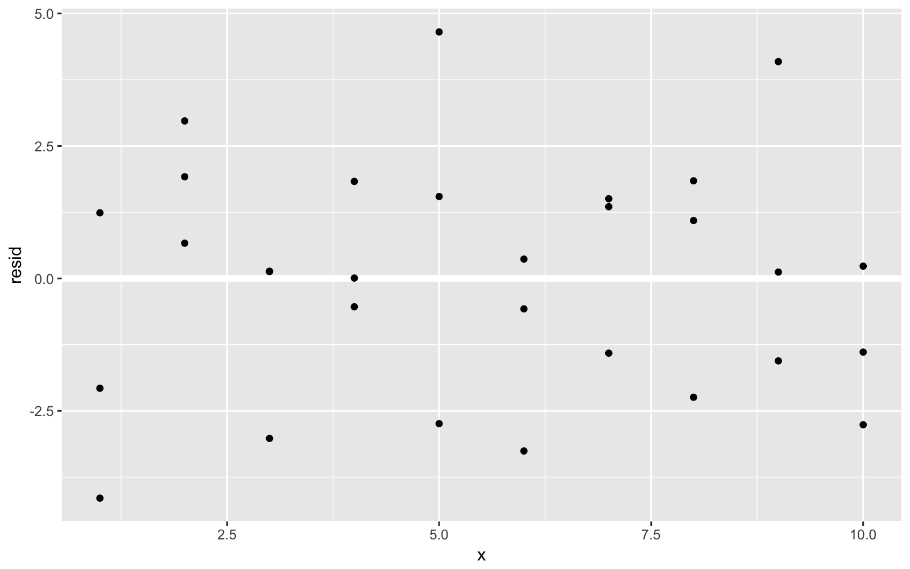
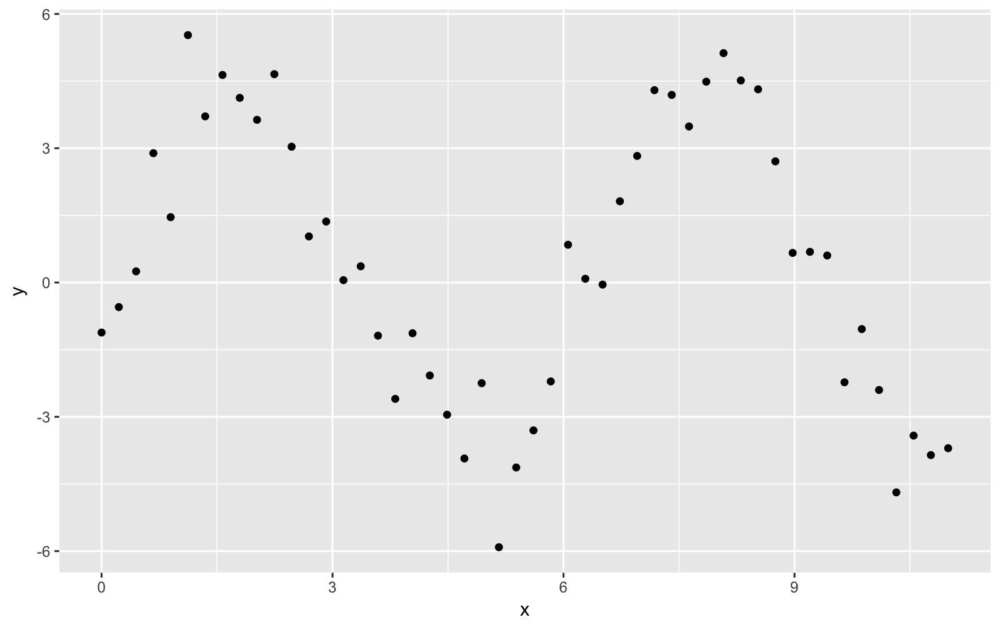
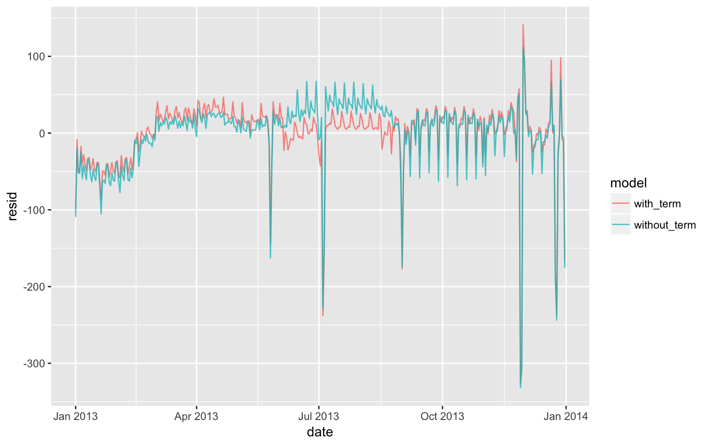
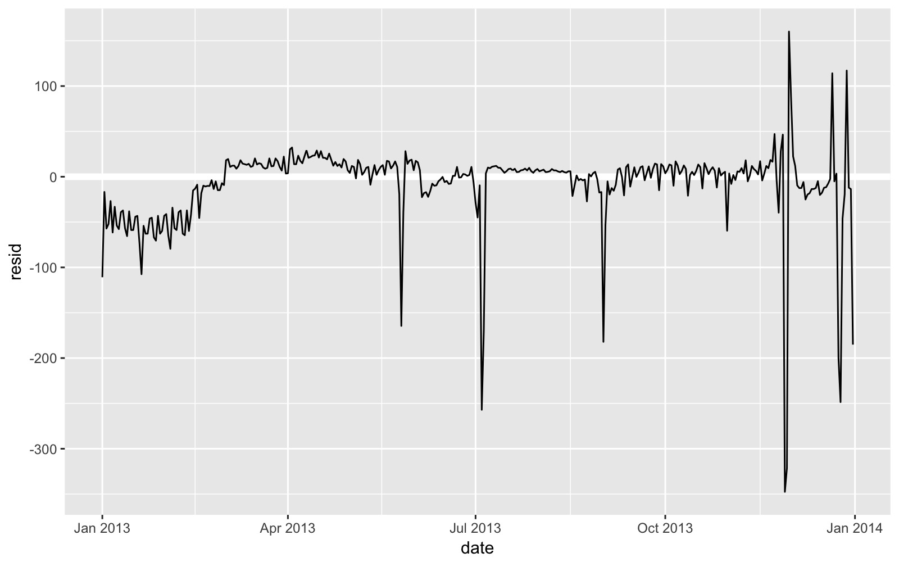

# R4DS Modeling Practice


### Hypothesis generation vs hypothesis confirmation
1. Each observation can either be used for exploration or confirmation, not both.
2. You can use an observation as many times as you like for exploration, but you can only use it once for confirmation.
As soon as you use an observation twice, you’ve switched from confirmation to exploration.

We'll be overly optomistic every time if these 2 ideas aren't adhered to.

#### Split data into 3 pieces before we begin:
1. 60%: training / exploration. Fit tons of models
2. 20%: query set. Use to compare models or visuals by hand
3. 20%: Test data. Can only use ONCE to test final model
### Simple Model 


```r
ggplot(sim1, aes(x, y)) + 
  geom_point()
```


```r
models <- tibble(
  a1 = runif(250, -20, 40),
  a2 = runif(250, -5, 5)
)

ggplot(sim1, aes(x, y)) + 
  geom_abline(aes(intercept = a1, slope = a2), data = models, alpha = 1/4) +
  geom_point() 
```


```r
sim1_mod <- lm(y ~ x, dat = sim1)

coef(sim1_mod)
```

```
## (Intercept)           x 
##    4.220822    2.051533
```

```r
ggplot(sim1, aes(x, y)) +
  geom_point() +
  geom_smooth(method = 'lm')
```


### Visualizing Models
Understanding a model by looking at it's predictions

First, get an evenly space grid of values with `modelr::data_grid()`


```r
grid <- sim1 %>%
  data_grid(x)

grid
```

```
## # A tibble: 10 x 1
##        x
##    <int>
##  1     1
##  2     2
##  3     3
##  4     4
##  5     5
##  6     6
##  7     7
##  8     8
##  9     9
## 10    10
```

```r
# add model predictions
grid <- grid %>%
  add_predictions(sim1_mod)

ggplot(sim1, aes(x)) +
  geom_point(aes(y = y)) +
  geom_line(data = grid, aes(x = x, y = pred), color = "red", size = 1)
```


#### Residuals


```r
sim1 <- sim1 %>%
  add_residuals(sim1_mod)

sim1
```

```
## # A tibble: 30 x 3
##        x     y    resid
##    <int> <dbl>    <dbl>
##  1     1  4.20 -2.07   
##  2     1  7.51  1.24   
##  3     1  2.13 -4.15   
##  4     2  8.99  0.665  
##  5     2 10.2   1.92   
##  6     2 11.3   2.97   
##  7     3  7.36 -3.02   
##  8     3 10.5   0.130  
##  9     3 10.5   0.136  
## 10     4 12.4   0.00763
## # ... with 20 more rows
```

Draw a frequency polygon to understand spread of residuals


```r
ggplot(sim1, aes(resid)) +
  geom_freqpoly(binwidth = 0.5)
```


```r
ggplot(sim1, aes(x, resid)) +
  geom_ref_line(h = 0) +
  geom_point()
```



```r
sim1_loess_mod <- loess(y ~ x, data = sim1)

grid <- grid %>%
  add_predictions(sim1_loess_mod)

ggplot(sim1, aes(x, y)) +
  geom_point() +
  geom_line(data = grid, aes(x, pred), color = "red")
```


```r
ggplot(sim1, aes(x, y)) +
  geom_point() +
  geom_smooth(method = 'loess', se = FALSE)
```


#### Looking at gather and spread predictions


```r
#sample data
df <- tibble::data_frame(
  x = sort(runif(100)),
  y = 5 * x + 0.5 * x ^ 2 + 3 + rnorm(length(x))
)

plot(df)
```


```r
# 2 different models
m1 <- lm(y ~ x, data = df)
m2 <- lm(y ~ poly(x, 2), data = df)

grid <- data.frame(x = seq(0, 1, length = 10))

grid %>% spread_predictions(m1, m2)
```

```
##            x       m1       m2
## 1  0.0000000 2.748853 2.701534
## 2  0.1111111 3.384440 3.363560
## 3  0.2222222 4.020027 4.019127
## 4  0.3333333 4.655615 4.668236
## 5  0.4444444 5.291202 5.310885
## 6  0.5555556 5.926789 5.947076
## 7  0.6666667 6.562376 6.576809
## 8  0.7777778 7.197963 7.200082
## 9  0.8888889 7.833550 7.816897
## 10 1.0000000 8.469138 8.427253
```

```r
grid %>% gather_predictions(m1, m2)
```

```
##    model         x     pred
## 1     m1 0.0000000 2.748853
## 2     m1 0.1111111 3.384440
## 3     m1 0.2222222 4.020027
## 4     m1 0.3333333 4.655615
## 5     m1 0.4444444 5.291202
## 6     m1 0.5555556 5.926789
## 7     m1 0.6666667 6.562376
## 8     m1 0.7777778 7.197963
## 9     m1 0.8888889 7.833550
## 10    m1 1.0000000 8.469138
## 11    m2 0.0000000 2.701534
## 12    m2 0.1111111 3.363560
## 13    m2 0.2222222 4.019127
## 14    m2 0.3333333 4.668236
## 15    m2 0.4444444 5.310885
## 16    m2 0.5555556 5.947076
## 17    m2 0.6666667 6.576809
## 18    m2 0.7777778 7.200082
## 19    m2 0.8888889 7.816897
## 20    m2 1.0000000 8.427253
```

#### Categorical Variables


```r
ggplot(sim2) + 
  geom_point(aes(x, y))
```


```r
mod2 <- lm(y ~ x, data = sim2)

grid <- sim2 %>% 
  data_grid(x) %>% 
  add_predictions(mod2)

grid
```

```
## # A tibble: 4 x 2
##   x      pred
##   <chr> <dbl>
## 1 a      1.15
## 2 b      8.12
## 3 c      6.13
## 4 d      1.91
```

```r
ggplot(sim2, aes(x)) + 
  geom_point(aes(y = y)) +
  geom_point(data = grid, aes(y = pred), colour = "red", size = 4)
```


#### Interactions - continuous and categorical variable


```r
ggplot(sim3, aes(x1, y)) + 
  geom_point(aes(colour = x2))
```


Two possible models below
`+`` looks at each effect independent of all others. Fitting the interaction and indvidual components with `*``


```r
mod1 <- lm(y ~ x1 + x2, data = sim3)
mod2 <- lm(y ~ x1 * x2, data = sim3)

grid <- sim3 %>%
  data_grid(x1, x2) %>%
  gather_predictions(mod1, mod2)

grid
```

```
## # A tibble: 80 x 4
##    model    x1 x2     pred
##    <chr> <int> <fct> <dbl>
##  1 mod1      1 a      1.67
##  2 mod1      1 b      4.56
##  3 mod1      1 c      6.48
##  4 mod1      1 d      4.03
##  5 mod1      2 a      1.48
##  6 mod1      2 b      4.37
##  7 mod1      2 c      6.28
##  8 mod1      2 d      3.84
##  9 mod1      3 a      1.28
## 10 mod1      3 b      4.17
## # ... with 70 more rows
```

```r
# visualize model predictions

ggplot(sim3, aes(x1, y, colour = x2)) + 
  geom_point() + 
  geom_line(data = grid, aes(y = pred)) + 
  facet_wrap(~ model)
```


```r
# look at residuals
sim3 <- sim3 %>% 
  gather_residuals(mod1, mod2)

ggplot(sim3, aes(x1, resid, colour = x2)) + 
  geom_point() + 
  facet_grid(model ~ x2)
```


Looking at the residuals, mod2 is clearly superior

#### Interactions - 2 continuous


```r
mod1 <- lm(y ~ x1 + x2, data = sim4)
mod2 <- lm(y ~ x1 * x2, data = sim4)

grid <- sim4 %>% 
  data_grid(
    x1 = seq_range(x1, 5), 
    x2 = seq_range(x2, 5) 
  ) %>% 
  gather_predictions(mod1, mod2)
grid
```

```
## # A tibble: 50 x 4
##    model     x1     x2   pred
##    <chr>  <dbl>  <dbl>  <dbl>
##  1 mod1  -1.00  -1.00   0.996
##  2 mod1  -1.00  -0.500 -0.395
##  3 mod1  -1.00   0     -1.79 
##  4 mod1  -1.00   0.500 -3.18 
##  5 mod1  -1.00   1.00  -4.57 
##  6 mod1  -0.500 -1.00   1.91 
##  7 mod1  -0.500 -0.500  0.516
##  8 mod1  -0.500  0     -0.875
##  9 mod1  -0.500  0.500 -2.27 
## 10 mod1  -0.500  1.00  -3.66 
## # ... with 40 more rows
```

```r
# use `seq_range to create a regularly spaced grid`

seq_range(c(0.0123, 0.923423), n = 5)
```

```
## [1] 0.0123000 0.2400808 0.4678615 0.6956423 0.9234230
```

```r
seq_range(c(0.0123, 0.923423), n = 5, pretty = TRUE)
```

```
## [1] 0.0 0.2 0.4 0.6 0.8 1.0
```

```r
x1 <- rcauchy(100)
seq_range(x1, n = 5)
```

```
## [1] -13.265719   9.958488  33.182695  56.406902  79.631108
```

```r
seq_range(x1, n = 5, trim = 0.10)
```

```
## [1] -3.7348863 -1.7852659  0.1643545  2.1139749  4.0635953
```

```r
x2 <- c(0, 1)
seq_range(x2, n = 5)
```

```
## [1] 0.00 0.25 0.50 0.75 1.00
```

```r
seq_range(x2,n = 5, expand = 0.10)
```

```
## [1] -0.050  0.225  0.500  0.775  1.050
```

```r
ggplot(grid, aes(x1, x2)) + 
  geom_tile(aes(fill = pred)) + 
  facet_wrap(~ model)
```


```r
ggplot(grid, aes(x1, pred, colour = x2, group = x2)) + 
  geom_line() +
  facet_wrap(~ model)
```


```r
ggplot(grid, aes(x2, pred, colour = x1, group = x1)) + 
  geom_line() +
  facet_wrap(~ model)
```


#### Transformations


```r
sim5 <- tibble(
  x = seq(0, 3.5 * pi, length = 50),
  y = 4 * sin(x) + rnorm(length(x))
)

ggplot(sim5, aes(x, y)) +
  geom_point()
```



```r
# Fit 5 models
library(splines)
mod1 <- lm(y ~ ns(x, 1), data = sim5)
mod2 <- lm(y ~ ns(x, 2), data = sim5)
mod3 <- lm(y ~ ns(x, 3), data = sim5)
mod4 <- lm(y ~ ns(x, 4), data = sim5)
mod5 <- lm(y ~ ns(x, 5), data = sim5)

grid <- sim5 %>% 
  data_grid(x = seq_range(x, n = 50, expand = 0.1)) %>% 
  gather_predictions(mod1, mod2, mod3, mod4, mod5, .pred = "y")

ggplot(sim5, aes(x, y)) + 
  geom_point() +
  geom_line(data = grid, colour = "red") +
  facet_wrap(~ model)
```


### Model Building


```r
library(nycflights13)
library(lubridate)

ggplot(diamonds, aes(cut, price)) + geom_boxplot()
```


```r
ggplot(diamonds, aes(color, price)) + geom_boxplot()
```


```r
ggplot(diamonds, aes(clarity, price)) + geom_boxplot()
```


Why do low quality diamonds have higher prices?


```r
# weight of the diamond is the confounding variable

ggplot(diamonds, aes(carat, price)) + 
  geom_hex(bins = 50)
```


Lets fit a model for price to separate out the effect of `carat`


```r
diamonds2 <- diamonds %>% 
  filter(carat <= 2.5) %>% 
  mutate(lprice = log2(price), lcarat = log2(carat))

# we've made this a linear pattern, which is easier to work with

ggplot(diamonds2, aes(lcarat, lprice)) + 
  geom_hex(bins = 50)
```


```r
mod_diamond <- lm(lprice ~ lcarat, data = diamonds2)

# undo log to see raw predictions
grid <- diamonds2 %>% 
  data_grid(carat = seq_range(carat, 20)) %>% 
  mutate(lcarat = log2(carat)) %>% 
  add_predictions(mod_diamond, "lprice") %>% 
  mutate(price = 2 ^ lprice)

ggplot(diamonds2, aes(carat, price)) + 
  geom_hex(bins = 50) + 
  geom_line(data = grid, colour = "red", size = 1)
```


```r
# check residuals
diamonds2 <- diamonds2 %>% 
  add_residuals(mod_diamond, "lresid")

ggplot(diamonds2, aes(lcarat, lresid)) + 
  geom_hex(bins = 50)
```


```r
# re graph motivating plots, just a a function of carat size
ggplot(diamonds2, aes(cut, lresid)) + geom_boxplot()
```


```r
ggplot(diamonds2, aes(color, lresid)) + geom_boxplot()
```


```r
ggplot(diamonds2, aes(clarity, lresid)) + geom_boxplot()
```


#### A more complicated model
Now we are going to create a model that also observe the effects of color, cut and clarity


```r
mod_diamond2 <- lm(lprice ~ lcarat + color + cut + clarity, data = diamonds2)

grid <- diamonds2 %>%
  data_grid(cut, lcarat = -0.515, color = "G", clarity = "SI1") %>%
  add_predictions(mod_diamond2)

grid
```

```
## # A tibble: 5 x 5
##   cut       lcarat color clarity  pred
##   <ord>      <dbl> <chr> <chr>   <dbl>
## 1 Fair      -0.515 G     SI1      11.0
## 2 Good      -0.515 G     SI1      11.1
## 3 Very Good -0.515 G     SI1      11.2
## 4 Premium   -0.515 G     SI1      11.2
## 5 Ideal     -0.515 G     SI1      11.2
```

```r
ggplot(grid, aes(cut, pred)) + 
  geom_point()
```


```r
# visualize residuals

diamonds2 <- diamonds2 %>% 
  add_residuals(mod_diamond2, "lresid2")

ggplot(diamonds2, aes(lcarat, lresid2)) + 
  geom_hex(bins = 50)
```


```r
# look at biggest residuals

diamonds2 %>% 
  filter(abs(lresid2) > 1) %>% 
  add_predictions(mod_diamond2) %>% 
  mutate(pred = round(2 ^ pred)) %>% 
  select(price, pred, carat:table, x:z) %>% 
  arrange(price)
```

```
## # A tibble: 16 x 11
##    price  pred carat cut       color clarity depth table     x     y     z
##    <int> <dbl> <dbl> <ord>     <ord> <ord>   <dbl> <dbl> <dbl> <dbl> <dbl>
##  1  1013   264 0.250 Fair      F     SI2      54.4  64.0  4.30  4.23  2.32
##  2  1186   284 0.250 Premium   G     SI2      59.0  60.0  5.33  5.28  3.12
##  3  1186   284 0.250 Premium   G     SI2      58.8  60.0  5.33  5.28  3.12
##  4  1262  2644 1.03  Fair      E     I1       78.2  54.0  5.72  5.59  4.42
##  5  1415   639 0.350 Fair      G     VS2      65.9  54.0  5.57  5.53  3.66
##  6  1415   639 0.350 Fair      G     VS2      65.9  54.0  5.57  5.53  3.66
##  7  1715   576 0.320 Fair      F     VS2      59.6  60.0  4.42  4.34  2.61
##  8  1776   412 0.290 Fair      F     SI1      55.8  60.0  4.48  4.41  2.48
##  9  2160   314 0.340 Fair      F     I1       55.8  62.0  4.72  4.60  2.60
## 10  2366   774 0.300 Very Good D     VVS2     60.6  58.0  4.33  4.35  2.63
## 11  3360  1373 0.510 Premium   F     SI1      62.7  62.0  5.09  4.96  3.15
## 12  3807  1540 0.610 Good      F     SI2      62.5  65.0  5.36  5.29  3.33
## 13  3920  1705 0.510 Fair      F     VVS2     65.4  60.0  4.98  4.90  3.23
## 14  4368  1705 0.510 Fair      F     VVS2     60.7  66.0  5.21  5.11  3.13
## 15 10011  4048 1.01  Fair      D     SI2      64.6  58.0  6.25  6.20  4.02
## 16 10470 23622 2.46  Premium   E     SI2      59.7  59.0  8.82  8.76  5.25
```

## Flight Data
What affects the number of daily flights?


```r
daily <- flights %>%
  mutate(date = make_date(year, month, day), wday = wday(date, label = TRUE)) %>%
  group_by(date, wday) %>%
  summarise(n = n())

daily
```

```
## # A tibble: 365 x 3
## # Groups:   date [?]
##    date       wday      n
##    <date>     <ord> <int>
##  1 2013-01-01 Tue     842
##  2 2013-01-02 Wed     943
##  3 2013-01-03 Thu     914
##  4 2013-01-04 Fri     915
##  5 2013-01-05 Sat     720
##  6 2013-01-06 Sun     832
##  7 2013-01-07 Mon     933
##  8 2013-01-08 Tue     899
##  9 2013-01-09 Wed     902
## 10 2013-01-10 Thu     932
## # ... with 355 more rows
```

```r
ggplot(daily, aes(date, n)) +
  geom_line()
```


```r
ggplot(daily, aes(wday, n)) +
  geom_boxplot()
```


```r
mod <- lm(n ~ wday, data = daily)

grid <- daily %>% 
  data_grid(wday) %>% 
  add_predictions(mod, "n")

ggplot(daily, aes(wday, n)) + 
  geom_boxplot() +
  geom_point(data = grid, colour = "red", size = 4)
```


```r
# look at residuals

daily <- daily %>% 
  add_residuals(mod)

daily %>% 
  ggplot(aes(date, resid)) + 
  geom_ref_line(h = 0) + 
  geom_line()
```


```r
ggplot(daily, aes(date, resid, colour = wday)) + 
  geom_ref_line(h = 0) + 
  geom_line()
```


```r
# there are patterns that the model is clearly missing

daily %>% 
  filter(resid < -100)
```

```
## # A tibble: 11 x 4
## # Groups:   date [11]
##    date       wday      n resid
##    <date>     <ord> <int> <dbl>
##  1 2013-01-01 Tue     842  -109
##  2 2013-01-20 Sun     786  -105
##  3 2013-05-26 Sun     729  -162
##  4 2013-07-04 Thu     737  -229
##  5 2013-07-05 Fri     822  -145
##  6 2013-09-01 Sun     718  -173
##  7 2013-11-28 Thu     634  -332
##  8 2013-11-29 Fri     661  -306
##  9 2013-12-24 Tue     761  -190
## 10 2013-12-25 Wed     719  -244
## 11 2013-12-31 Tue     776  -175
```

```r
# lots of holidays

daily %>% 
  ggplot(aes(date, resid)) + 
  geom_ref_line(h = 0) + 
  geom_line(colour = "grey50") + 
  geom_smooth(se = FALSE, span = 0.20)
```


#### Seasonal saturday effect


```r
daily %>% 
  filter(wday == "Sat") %>% 
  ggplot(aes(date, n)) + 
  geom_point() + 
  geom_line() +
  scale_x_date(NULL, date_breaks = "1 month", date_labels = "%b")
```


```r
term <- function(date) {
  cut(date, 
      breaks = ymd(20130101, 20130605, 20130825, 20140101),
      labels = c("spring", "summer", "fall") 
  )
}

daily <- daily %>% 
  mutate(term = term(date)) 

daily %>% 
  filter(wday == "Sat") %>% 
  ggplot(aes(date, n, colour = term)) +
  geom_point(alpha = 1/3) + 
  geom_line() +
  scale_x_date(NULL, date_breaks = "1 month", date_labels = "%b")
```


```r
daily %>% 
  ggplot(aes(wday, n, colour = term)) +
  geom_boxplot()
```


```r
# add term to model
mod1 <- lm(n ~ wday, data = daily)
mod2 <- lm(n ~ wday * term, data = daily)

daily %>% 
  gather_residuals(without_term = mod1, with_term = mod2) %>% 
  ggplot(aes(date, resid, colour = model)) +
  geom_line(alpha = 0.75)
```



```r
# overlay model predictons on raw data
# here we see that outliers are really affecting our estimates

grid <- daily %>% 
  data_grid(wday, term) %>% 
  add_predictions(mod2, "n")

ggplot(daily, aes(wday, n)) +
  geom_boxplot() + 
  geom_point(data = grid, colour = "red") + 
  facet_wrap(~ term)
```


```r
mod3 <- MASS::rlm(n ~ wday * term, data = daily)

daily %>% 
  add_residuals(mod3, "resid") %>% 
  ggplot(aes(date, resid)) + 
  geom_hline(yintercept = 0, size = 2, colour = "white") + 
  geom_line()
```



bundle variable computation to avoid errors


```r
compute_vars <- function(data) {
  data %>% 
    mutate(
      term = term(date), 
      wday = wday(date, label = TRUE)
    )
}
```

##### time of year: alternative approach


```r
mod <- MASS::rlm(n ~ wday * ns(date, 5), data = daily)

daily %>% 
  data_grid(wday, date = seq_range(date, n = 13)) %>% 
  add_predictions(mod) %>% 
  ggplot(aes(date, pred, colour = wday)) + 
  geom_line() +
  geom_point()
```


